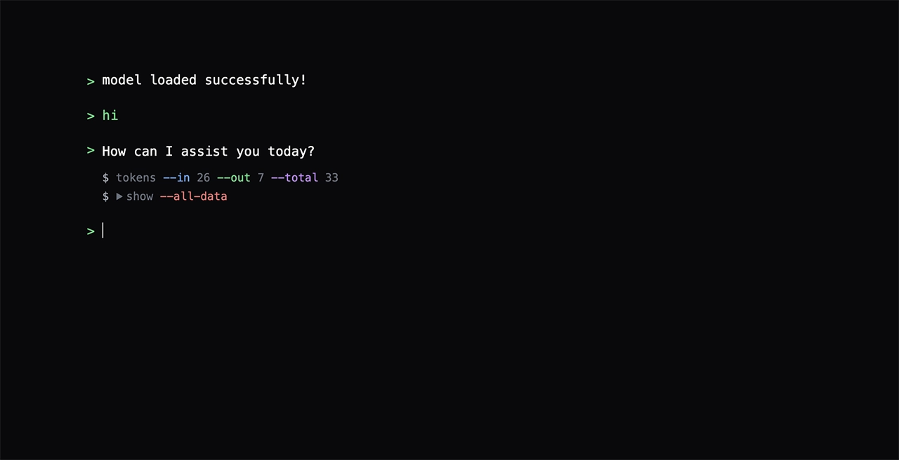

# Terminal Chat LLM

Web-based AI chat application with a terminal-inspired UI, built with Sveltekit and [MLC Web LLM](https://webllm.mlc.ai/).

## Features

- Local language model execution in the browser
- Markdown rendering with code syntax highlighting
- Token usage tracking
- Commands for help, clearing chat, and exporting as markdown
- Terminal-like chat interface

## How It Works

Terminal Chat LLM runs language models directly in your browser using [MLC Web LLM](https://webllm.mlc.ai/), ensuring privacy and low latency. All processing happens locally—no data is sent to external servers.

## Live Demo

[Try Terminal Chat LLM online](https://chat.taha.gg)

## Stack

- Sveltekit
- Tailwind CSS
- [MLC Web LLM](https://webllm.mlc.ai/) for browser-based AI inference
- [Marked](https://github.com/markedjs/marked) for markdown parsing

## License

